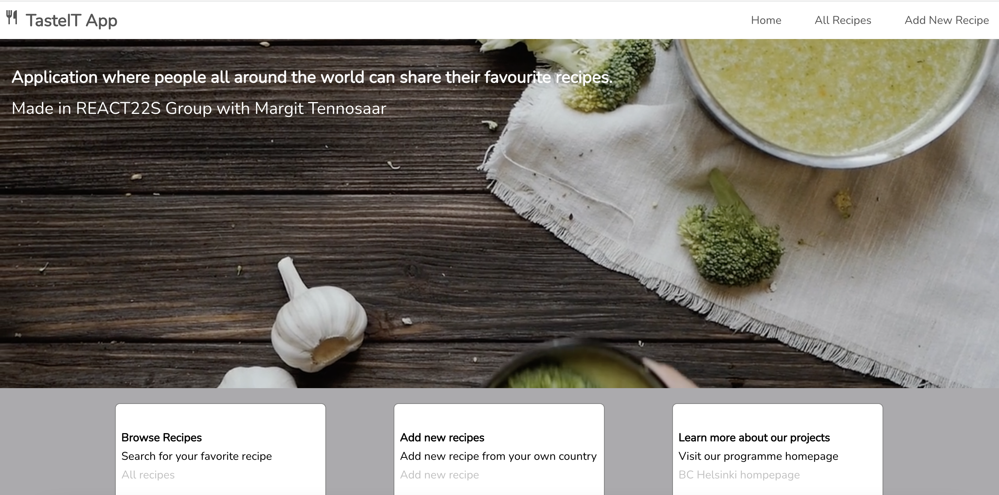
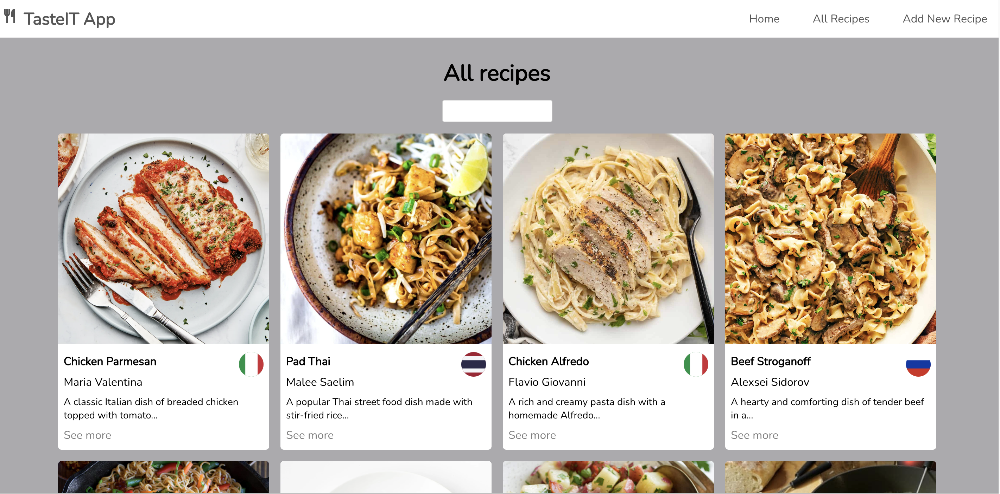

# TasteIT

TasteIt App is a learninig project which was built as a part of React course with Margit Tenosaar [@margittennosaar](https://www.github.com/margittennosaar)

# About

Application where people can browse different recipes from all over the world and share their own favourite recipes.

# Landing page

# Browsing recipes page

## to run project

- `npm install` to install all dependencies
- `npm run server` to run JSON Server
- `npm start` to run the app on http://localhost:3000/

## Technologies used

- React
- Axios
- JSON Server
- For fetching countries used [Countries API](https://restcountries.com/).
- Database (db.json) was generated by ChatGPT and provided by fellow student at Business College Helsinki.
